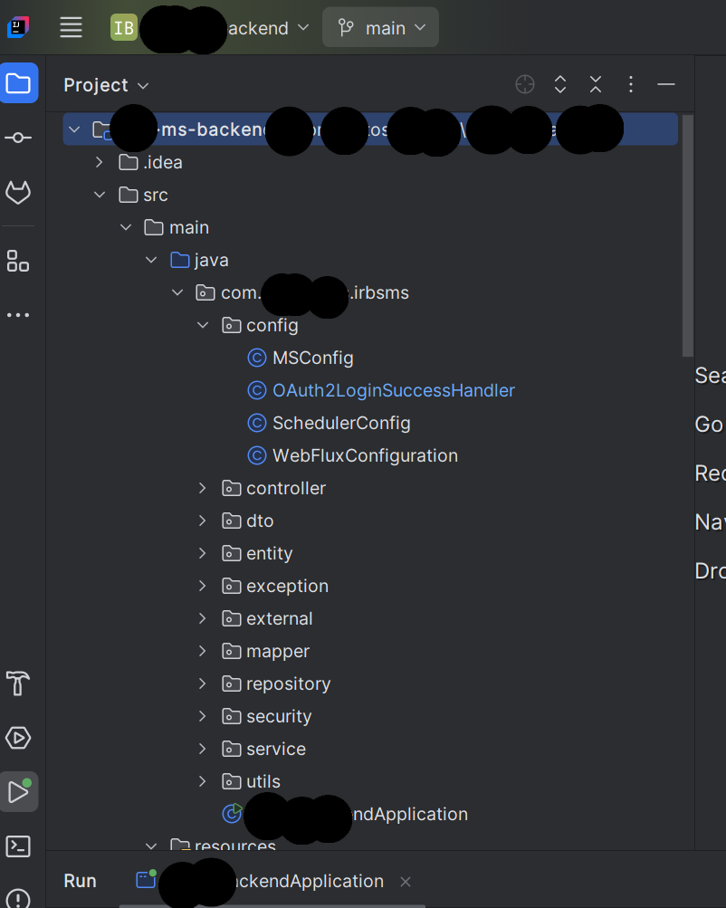

// Root README.md (already included above)

// backend-springboot/README.md

# 🔙 Backend – Spring Boot REST API

This folder outlines the **Spring Boot REST API backend** powering the insurance app and dashboard. It includes authentication, policy handling, and secure data flow.

🔒 *The actual code is private due to sensitive client integrations and business rules.*

## 🔧 Tech Stack
- Java 17
- Spring Boot (Web, Security, Data JPA)
- MySQL Database
- JWT Authentication
- Swagger (for internal API docs)

## 📌 Features
- Secure login (JWT-based)
- API endpoints for users, policies, and claims
- Role-based access (admin vs client)
- MySQL persistence layer

## 📸 Screenshots

### 🏠 IDE & Source Screen

---

*This showcase structure highlights the architecture and features without exposing any proprietary logic.*
