// Root README.md (already included above)

// flutter-app/README.md

# 📱 Flutter App – Insurance App Showcase

This folder showcases the **Flutter mobile app** I developed for a small insurance business. The app is built using modern Flutter practices and connects to a secure REST API. 

🔒 *The source code is not public to protect client confidentiality.*

## 🔧 Tech Stack
- Flutter & Dart
- State management: Riverpod
- REST API integration (Spring Boot backend)
- Material Design 3 UI
- Firebase (planned for deployment)

## 🧠 Key Features
- User login
- Policy list and detail view
- Claims submission form
- Status indicators (active/inactive)

## 🖼️ Screenshots
### 🏠 Welcome Screen
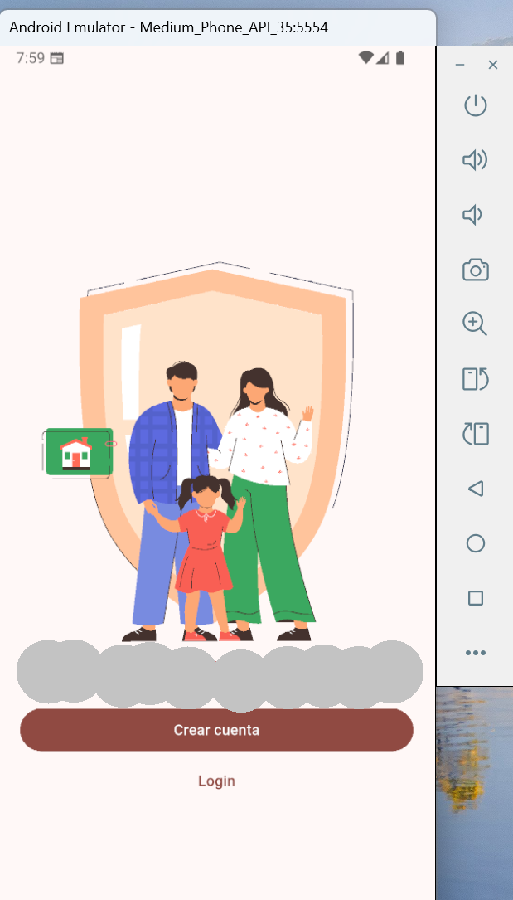
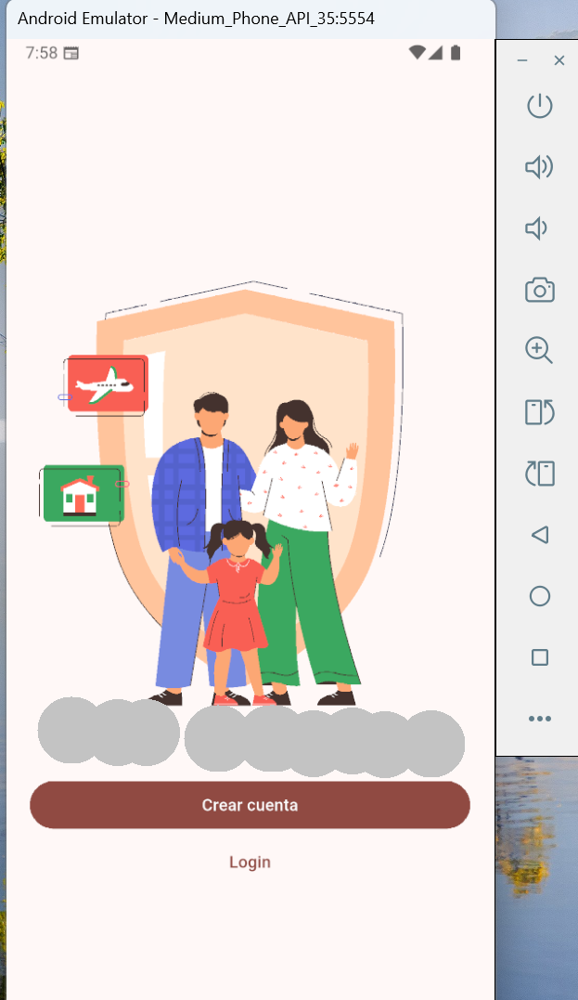
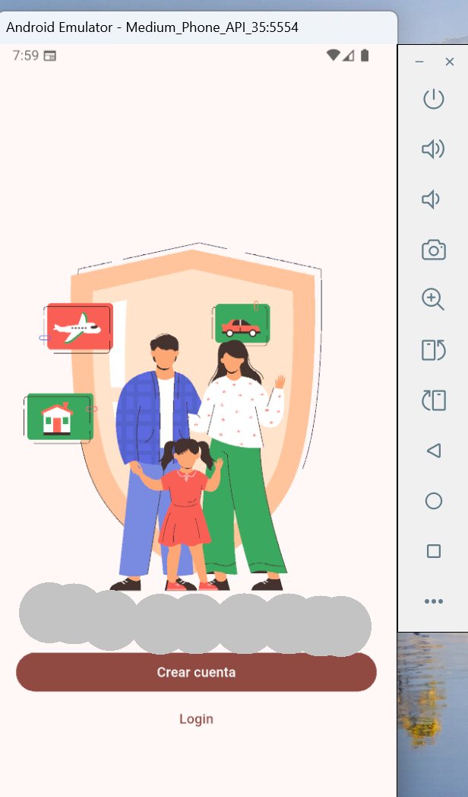
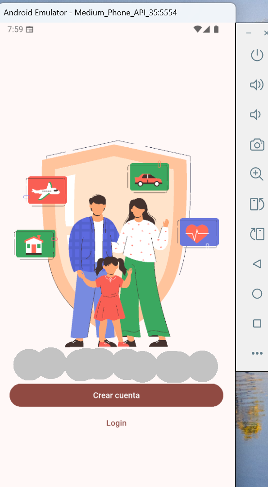
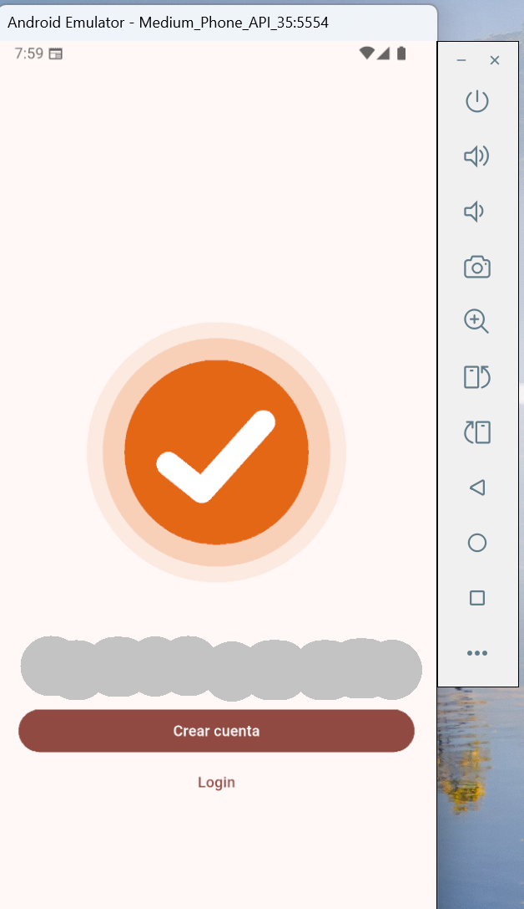

### 🏠 Login Screen
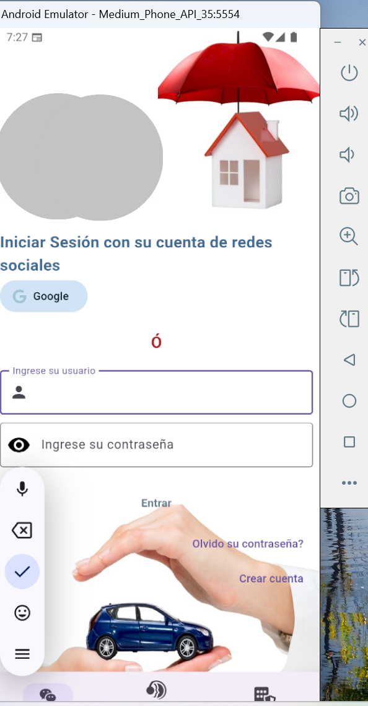
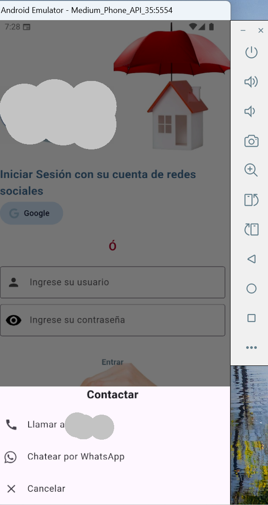
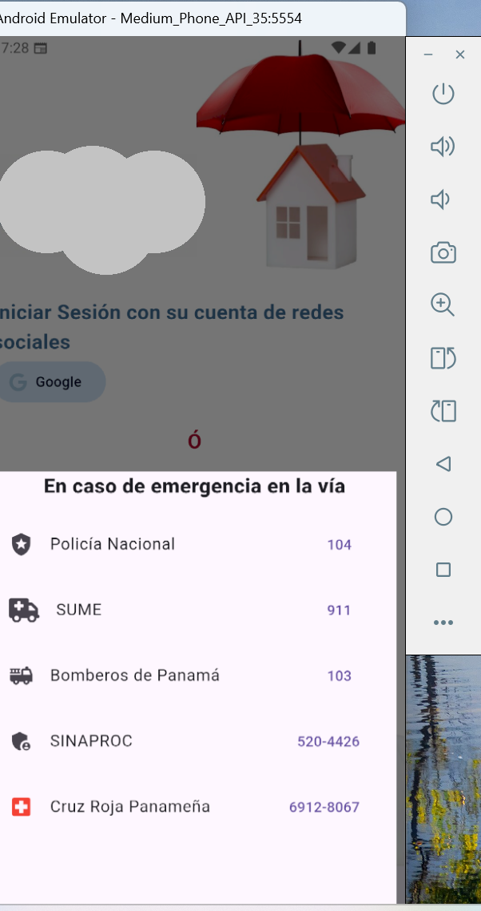
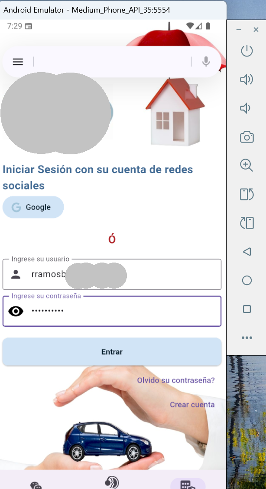

### 🏠 Home Screen
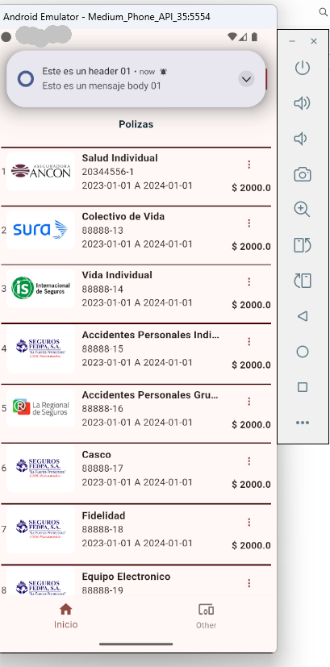
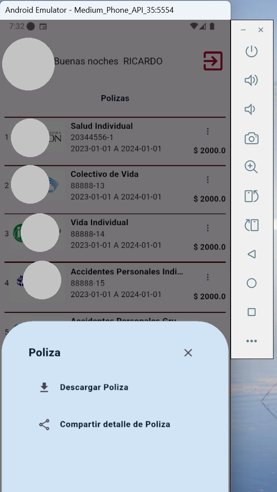
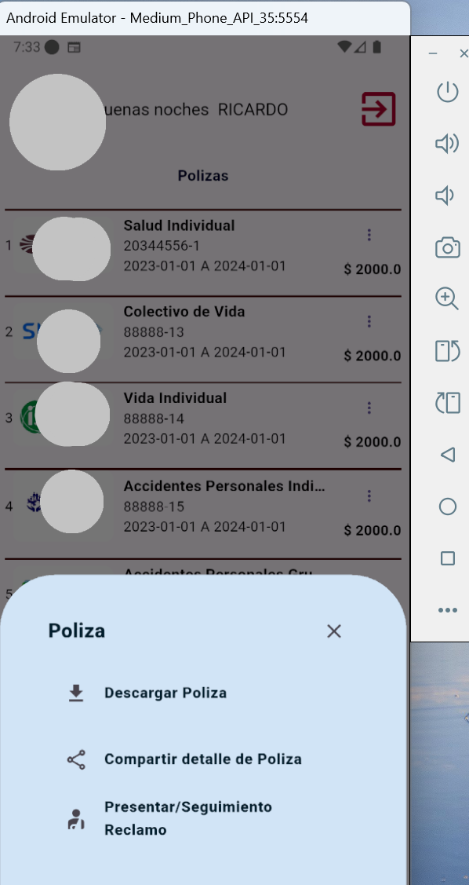
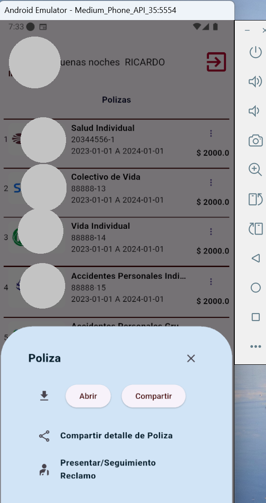
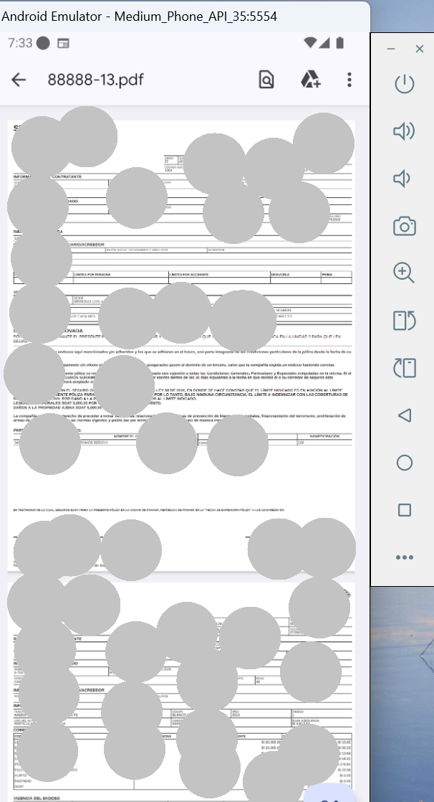
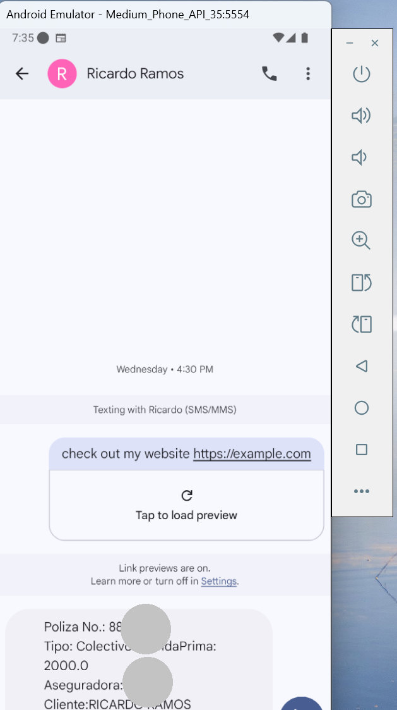
---

*This showcase structure highlights the architecture and features without exposing any proprietary logic.*
