// Root README.md (already included above)

// frontend-react/README.md

# 💻 Web Frontend – Insurance Client & Admin 

This folder showcases the **React-based client & admin** developed using Vite and Tailwind CSS. This web app is used by administrators to manage client policies and claims.

🔒 *The actual source code is not public to protect business logic and data.*

## 🔧 Tech Stack
- React.js (with Vite)
- Tailwind CSS
- Axios for API calls
- React Router for navigation

## 🧠 Key Features
- Admin login (protected routes)
- Dashboard overview
- Manage client policies
- Claim tracking and status updates

## 📸 Screenshots

### 🏠 Home Screen
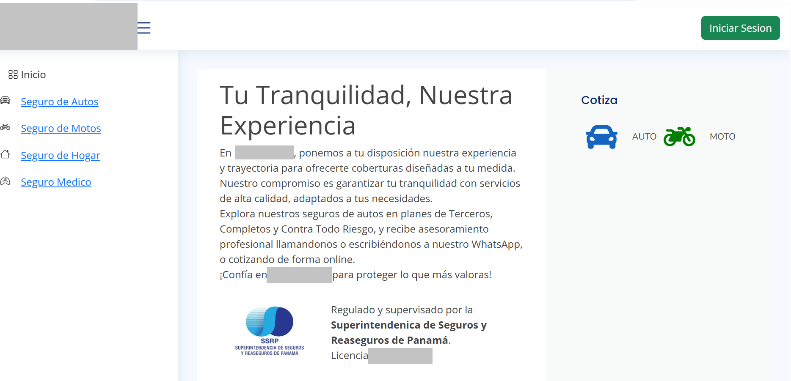
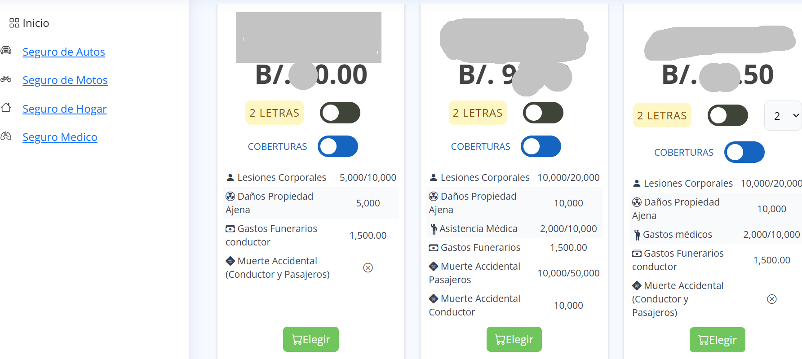

### 🏠Cotiza Screen
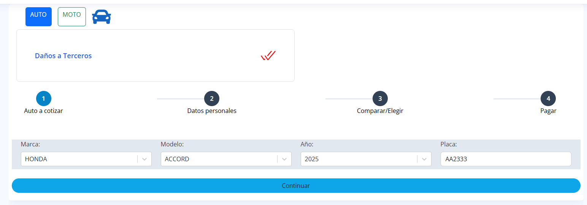
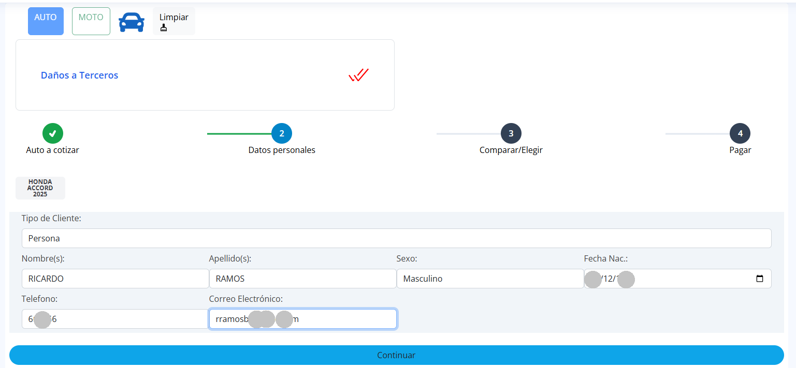
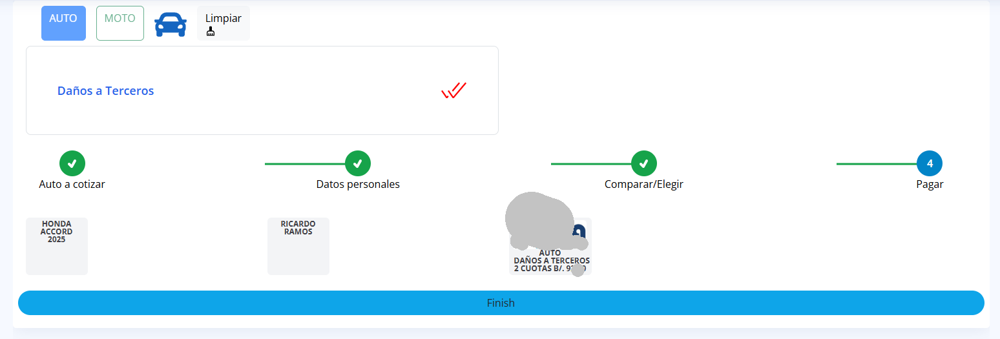

### 🏠 Login Screen
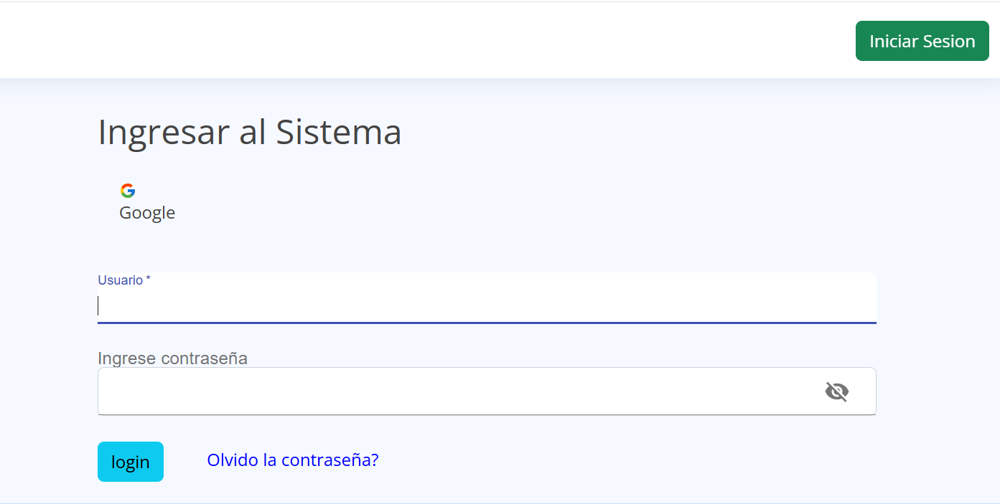
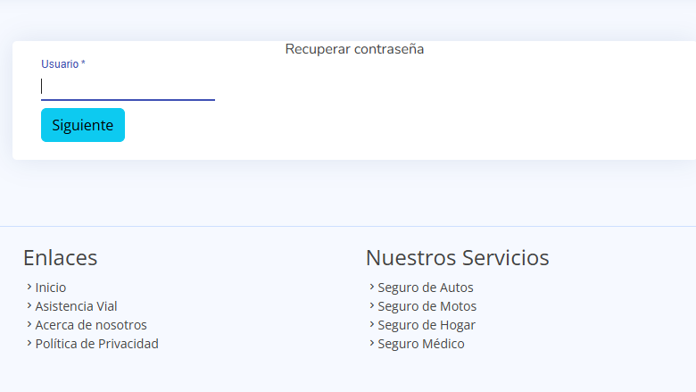
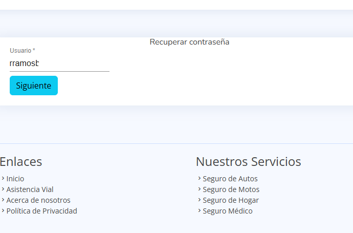
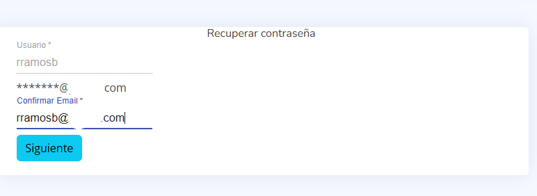
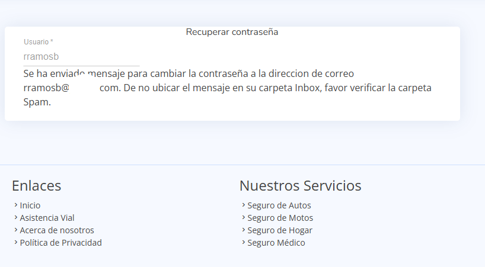
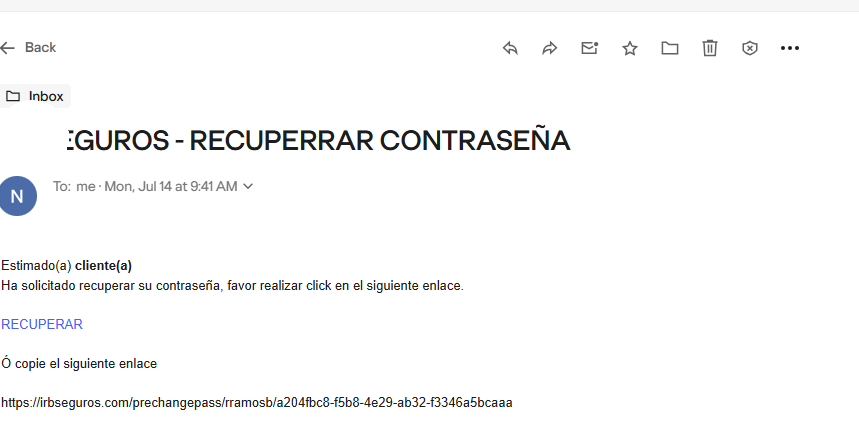
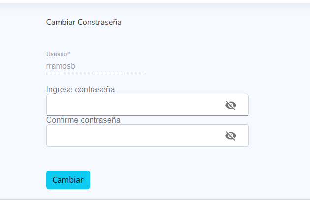

### 🏠 Admin Screen
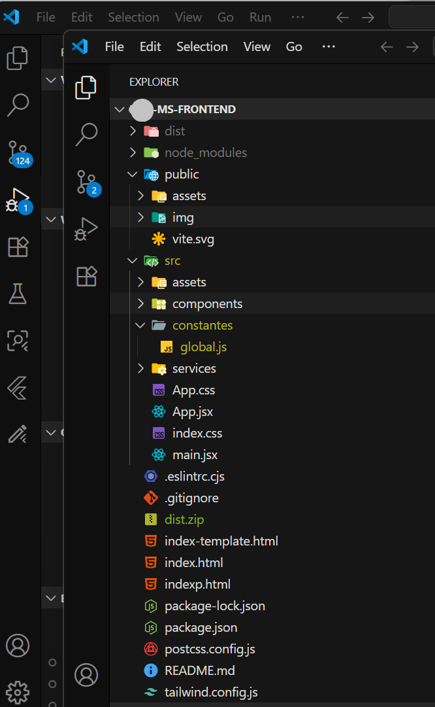
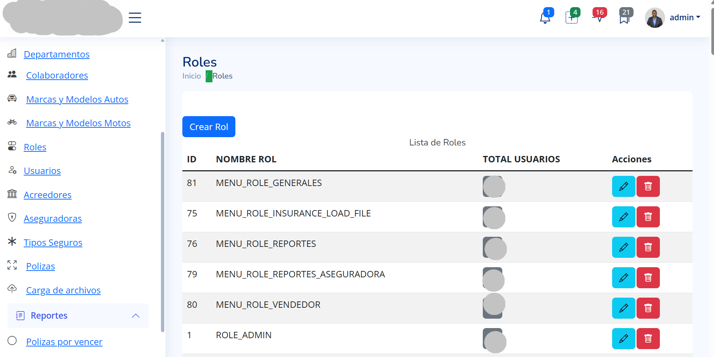

### 🏠 Reports Screen
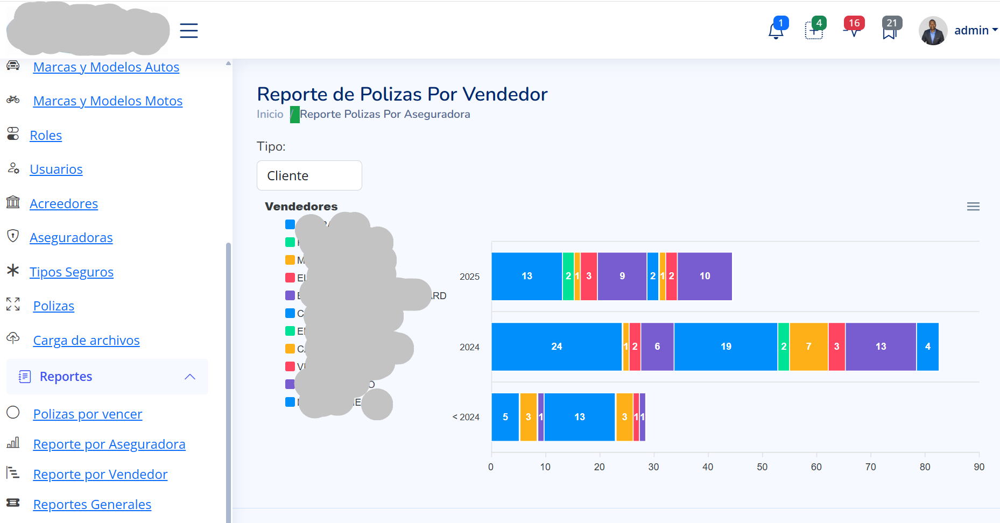
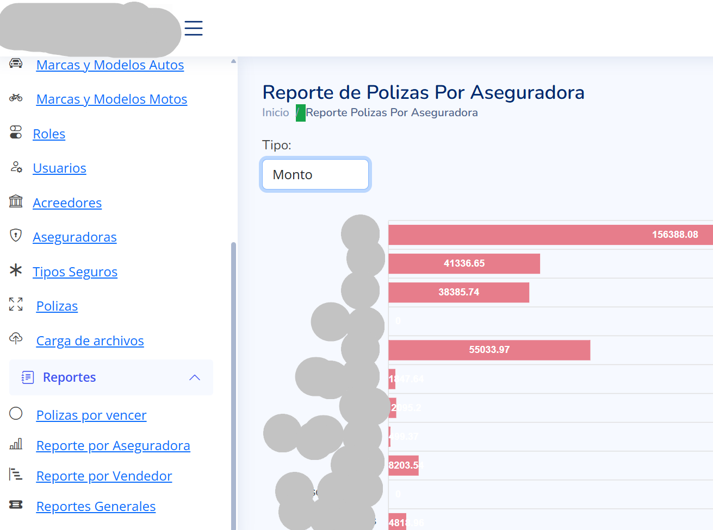
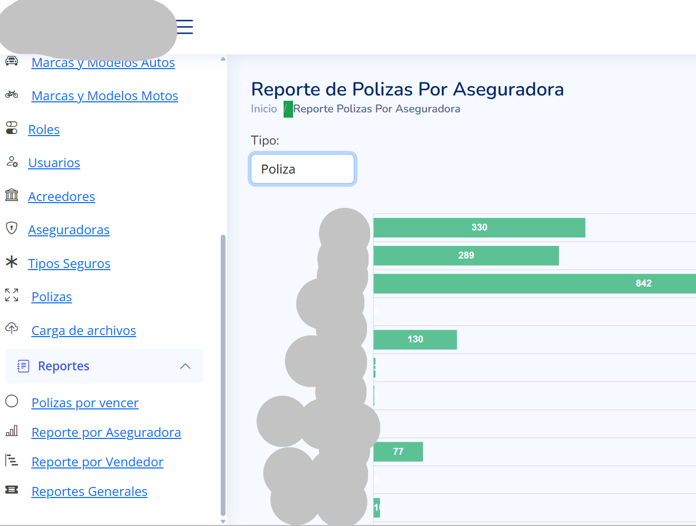

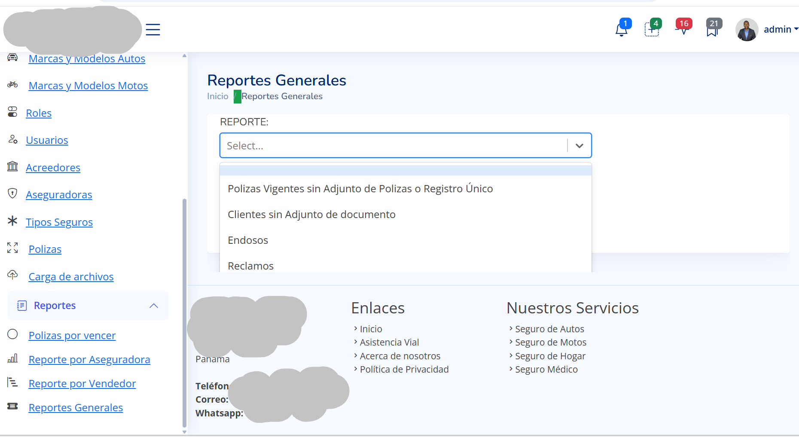

### 🏠 IDE Screen

---

*This showcase structure highlights the architecture and features without exposing any proprietary logic.*
